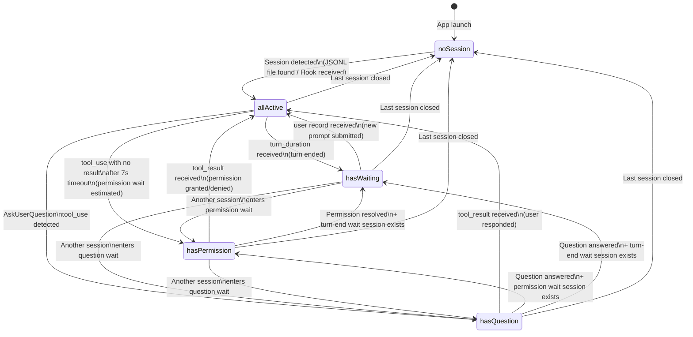
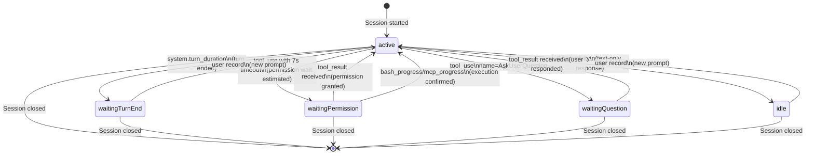
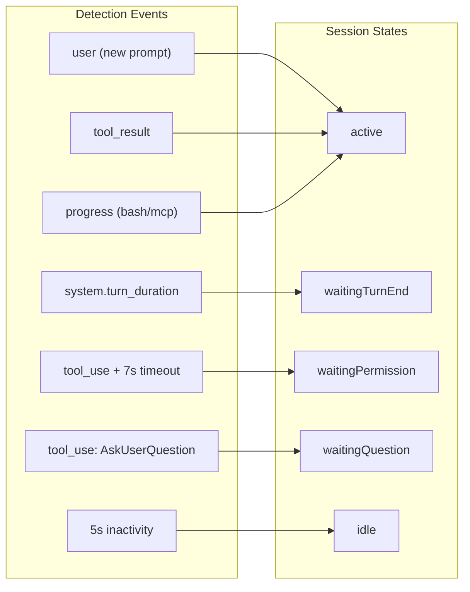

# App Icon State Transition Diagram

## Overview

The CCBar menu bar app icon reflects the **aggregated state of all monitored sessions**.
Individual session `AgentStatus` values are aggregated by priority to determine a single icon state.

---

## Icon State Definitions

| Icon State | Meaning | Visual |
|------------|---------|--------|
| `noSession` | No active sessions | Inactive icon (gray) |
| `allActive` | All sessions are working | Default icon |
| `hasWaiting` | 1+ sessions awaiting user input | Notification icon (badge) |
| `hasPermission` | 1+ sessions awaiting permission approval | Warning icon (!) |
| `hasQuestion` | 1+ sessions awaiting question response | Question icon (?) |

**Priority**: `hasQuestion` > `hasPermission` > `hasWaiting` > `allActive` > `noSession`

---

## Icon State Transition Diagram



---

## Individual Session State Transition (AgentStatus)



---

## Event-State Mapping Summary



---

## Icon Aggregation Logic (Pseudocode)

```
func computeIconState(sessions: [SessionInfo]) -> IconState {
    if sessions.isEmpty { return .noSession }
    if sessions.contains(where: { $0.status == .waitingQuestion })   { return .hasQuestion }
    if sessions.contains(where: { $0.status == .waitingPermission }) { return .hasPermission }
    if sessions.contains(where: { $0.status == .waitingTurnEnd || $0.status == .idle }) { return .hasWaiting }
    return .allActive
}
```
